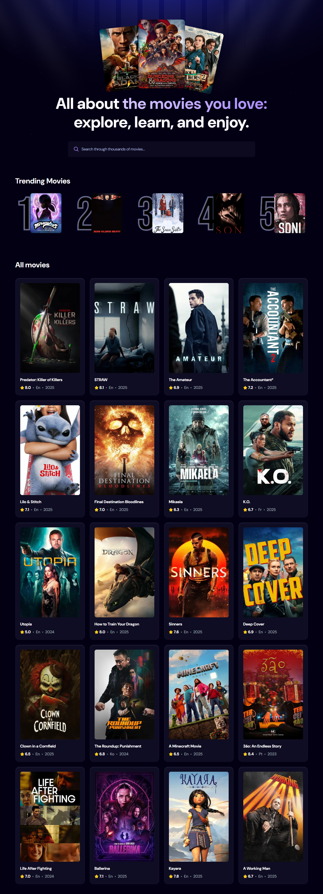
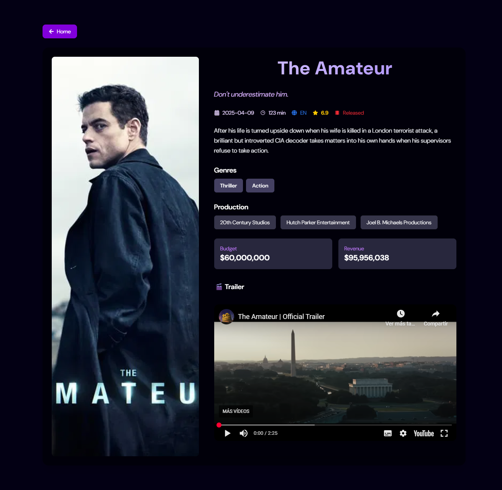
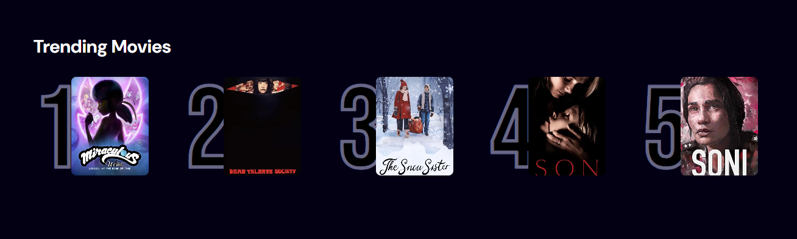

# 🎬 MovieApp

A modern movie browser built with **React** and **Vite**, powered by the **TMDB API** and **Appwrite**, that lets users explore, compare and track trending movies — all from an intuitive and responsive interface.

🔗 **Live Demo:** [movie-app-indol-sigma-76.vercel.app](https://movie-app-indol-sigma-76.vercel.app)

---

## 🌟 Why this project matters

MovieApp is more than a portfolio piece — it's a working simulation of how people search for entertainment in the real world. Built with production-ready tools and scalable design principles, it demonstrates my ability to craft modern, interactive, and data-driven web applications.

---

## 🎯 Real-World Value

In everyday life, people often want to know which movie to watch next, but switching between sites to check trailers, ratings, or reviews is time-consuming.

MovieApp solves that by:

- 🧠 **Making movie discovery easier** — users can instantly access detailed information about movies they’re interested in.
- ⭐ **Helping people compare movies** — with side-by-side access to ratings, genres, and synopses, users can decide which film better suits their taste.
- 🔄 **Tracking search trends** — the “Top Movies” section updates based on real user searches, providing insight into what's popular at any given moment.
- 🎯 **Offering convenience and clarity** — instead of switching between sites, users can evaluate multiple titles in one place and choose with confidence.

---

## 🚀 Tech Stack

- **Frontend:** React, Vite, Tailwind CSS
- **API:** The Movie Database (TMDB)
- **Backend-as-a-Service:** Appwrite (for search analytics)
- **Deployment:** Vercel

---

## 🔑 Features

- 🔍 **Real-time search** with dynamic suggestions
- 🏆 **Top Searches:** Uses Appwrite to track which movies are most frequently searched
- 🎞️ **Movie detail view** with full info: poster, genres, description, rating, release date
- 📱 **Responsive design** for mobile and desktop
- 🔐 **Environment-safe API keys** via `.env.local`

---

## ⚛️ React in Action

- 🧩 **Component-based architecture** for clean, reusable UIs
- 🧠 **Hooks (`useState`, `useEffect`)** to manage app state and side effects
- 🔄 **Conditional rendering** for loading states and dynamic data
- 🌐 **React Router DOM** for SPA navigation
- 🔐 **Environment variables** to securely manage sensitive data
  
---

## 📸 Screenshots

  

---

## 🧠 What I Learned

- Working with live APIs (TMDB)
- Using Appwrite to log and retrieve dynamic backend data
- Managing complex state and routing in React
- Creating responsive UIs with Tailwind
- Deploying production-ready apps with Vercel

---

## 📦 Installation

`git clone https://github.com/Ferny1011/movie-app.git`
`cd movie-app`
`npm install`
`npm run dev`

🔐 Environment Variables
Create a .env.local file in the root directory and add the following:

`VITE_TMDB_API_KEY=your_tmdb_api_key`
`VITE_APPWRITE_PROJECT_ID=your_project_id`
`VITE_APPWRITE_ENDPOINT=https://your-appwrite-endpoint`

